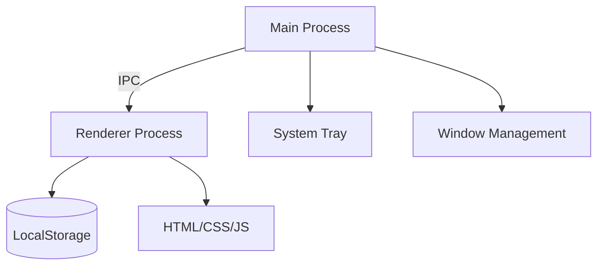

# Project Tracker Widget


## Table of Contents

- [Features](#-features)
- [Download](#-download)
- [Installation](#-installation)
- [Usage](#-usage)
- [Build From Source](#-build-from-source)
- [Technical Details](#-technical-details)
- [Troubleshooting](#-troubleshooting)
- [Contributing](#-contributing)
- [License](#-license)

## 📸 Gallery

<div align="center">
  
**Light Mode** | **Dark Mode**
--- | ---
 | 

| **Project View**                             | **Statistics View**                       |
| -------------------------------------------- | ----------------------------------------- |
|  |  |

**Minimize Widget**


</div>

## ✨ Features

**Minimal Productivity Booster**

- Always-on-top transparent window
- System tray integration
- 350px compact design (resizable)
- Dark/light mode with custom colors

**Project Management**

- Track projects through 6 stages:

Planning → Development → Testing → Completed → Deployed → Resume Added

- Real-time statistics dashboard
- Keyboard-friendly controls

**Smart Behavior**

- Remembers window position/size
- Single instance prevention
- Low memory footprint (~60MB)

## 💾 Download

Get the latest pre-built executable:  
[Download v1.0.0](https://github.com/yourusername/project-tracker-widget/releases/latest)

**Supported Formats**:

- Windows: `Project Tracker Widget.exe`
- macOS: `.dmg` (Coming Soon)
- Linux: `.AppImage` (Coming Soon)

## 📥 Installation

### Windows Users

1. Download the `.exe` from Releases
2. Run the executable (no installer needed)
3. Right-click the tray icon to pin to taskbar

### Developers

```bash
git clone https://github.com/MaryamAli-2020/project-tracker-widget.git
cd dist/win-unpacked
Start-Process "Project Tracker Widget.exe"
```

**You can easily just go to the directory mentioned above and double click on the exe file**

## 🖱️ Usage

### Basic Controls:

- - Button: Add new project
- ← → Buttons: Change project status
- Settings Gear: Change theme/color
- 📌 Icon: Toggle always-on-top

### Keyboard Shortcuts:

Shortcut Action
Ctrl+Shift+P Show/hide window
Esc Close active dialog

### System Tray:

- Right-click for quick access menu
- Left-click to show/hide

## 🔨 Build From Source

1. Ensure you have:

- Node.js v16+
- npm/yarn
- Git

2. Build commands:

```bash
# Development
npm start

# Create executable
npm run dist

# Clean build
rm -rf node_modules dist
npm install
```

## ⚙️ Technical Details

### Architecture:



### Tech Stack:

- Frontend: Vanilla JS + Lucide Icons
- Backend: Electron 27
- Packaging: electron-builder
- Size: ~60MB (unpacked)

### File Structure:

```text
/dist
  /win-unpacked
    Project Tracker Widget.exe
    resources/
      app.asar
      electron.ico
```

## 🚨 Troubleshooting

### Common Issues:

1. GPU Process Warning:

- Safe to ignore GPU process exited messages
- Already handled by disable-gpu flags

2. Windows Defender Blocking:

```text
Click "More Info" → "Run Anyway"
```

3. Window Not Appearing:

- Check system tray for active icon
- Try Alt+Tab to locate

4. Logs Location:

```text
%APPDATA%\Project Tracker Widget\logs
```

## 🤝 Contributing

1. Fork the repository
2. Create a feature branch (git checkout -b feature/amazing)
3. Commit changes (git commit -m 'Add amazing feature')
4. Push (git push origin feature/amazing)
5. Open a Pull Request

#### Planned Features:

- Cloud sync
- Due date tracking
- Export/Import projects

## 📜 License

MIT © 2025 Maryam Ali
